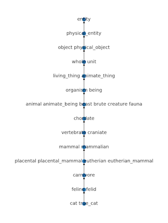
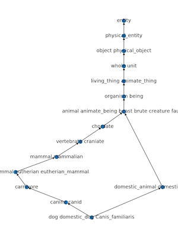

### WordNet

The [WordNet](https://wordnet.princeton.edu/) is a database of lexical relations
for English developed at Princeton University. WordNet organizes
words into synsets and specifies semantic relations between the synsets.

For example, in WordNet 3.0 the noun lemma `dog` appears in 7 synsets:

>- [20611] andiron firedog dog dog-iron: metal supports for logs in a fireplace
>- [26824] cad bounder blackguard dog hound heel: someone who is morally reprehensible
>- [35929] dog: informal term for a man
>- [35930] dog domestic_dog Canis_familiaris: a member of the genus Canis (probably descended from the common wolf) that has been domesticated by man since prehistoric times; occurs in many breeds
>- [41436] frank frankfurter hotdog hot_dog dog wiener wienerwurst weenie: a smooth-textured sausage of minced beef or pork usually smoked; often served on a bread roll
>- [41735] frump dog: a dull unattractive unpleasant girl or woman
>- [59573] pawl detent click dog: a hinged catch that fits into a notch of a
ratchet to move a wheel forward or prevent it from moving backward

The different synsets a lemma appears in typically point to different senses
of that lemma. In the example above, the most prominent sense of the word
`dog` is the one in synset 35930: `a member of the genus Canis (probably
descended from the common wolf) that has been domesticated by man since
prehistoric times; occurs in many breeds`.

Note that a synset can have multiple lemmas - e.g. synset 35930 has 3
lemmas: `dog`, `domestic_dog` and `Canis_familiaris`.

A synset can also be characterized in terms of its position in the WordNet
graph. The figures display the paths connecting the synsets for the `domestic_cat`
and the `domestic_dog` to the *nominal root* of the WordNet graph, the `entity` synset.
Note that while there is a single path to the `entity` synset from the `domestic_cat` synset,
there are two different paths connecting the `domestic_dog` synset to `entity`.

 

A directed edge connects each synset to its hypermym(s), e.g. the hypernym
synsets of the `domestic_dog` synset are `canine canid` and `domestic_animal
domesticated_animal`. 

 __The WordNet class is to represent the
WordNet synsets__ and the hyperonymy relation between them, and to support a variety
of queries for __extracting the information__ encoded in the hierarchical structure
of WordNet.

* Node: each synset
* Graph: WordNet
* points to hyper(destination)

## 1. The WordNet data structure

Write a `WordNet` class containing the following methods:

- `def __init__(self, synsets_file, hypernyms_file)`

constructor for the WordNet class, having as parameters two file paths: one for
the synsets file and one for the hypernyms file. We will be working with a subset of
WordNet 3.0: the noun synsets and the `hypernym` and `instance_hypernym`
relations. The `data` directory contains the files `synsets.txt` and
`hypernyms.txt`, both in CSV format (comma-separated values).

The `synsets.txt` file lists all the noun synsets, one per line. Each line lists
the `id` of the synsets, a list of `lemmas` separated by spaces, and the `gloss` of
the synsets. Note that multiword lemmas are connected via underscores - e.g. `domestic_dog`.

>- 27181,canine canid,any of various fissiped mammals with nonretractile claws and typically long muzzles
>- ...
>- 35930,dog domestic_dog Canis_familiaris,a member of the genus Canis (probably descended from the common wolf) that has been domesticated by man since prehistoric times; occurs in many breeds
>- 35931,dog's_breakfast dog's_dinner,a poor job; a mess
>- 35932,dog's_mercury dog_mercury Mercurialis_perennis,European perennial weedy plant with greenish flowers
>- 35933,dog-day_cicada harvest_fly,its distinctive song is heard during July and August
>- 35934,dog-ear,a corner of a page turned down to mark your place
>- ...
>- 36030,domestic_animal domesticated_animal,any of various animals that have been tamed and made fit for a human environment

The `hypernyms.txt` file lists the direct hypernyms of each synset. A synset is
identified by its id. The file lists first the id of a synset, and then the ids
of all its hypernym synsets, separated by commas.

>- 35930,27181,36030
>- 35931,40366
>- 35932,45788
>- 35933,29333
>- 35934,70150
>- 35935,31844

Synsets and relations are modeled using separate classes.

The `Synset` class should store information related to the id of a synset, its
lemmas and its definition. It might be useful to separate the information
about lemmas using another abstraction - the `Lemma` class.
**A synset should keep track of the lemmas it has, and provide an iteration over
its lemmas - e.g. `for lemma in synset` (remember that a class can provide a specific
iteration by implementing the `__iter__` method).**

Also, the `Synset` class should provide methods for querying what is the id,
what are the lemmas and what is the gloss of the current synset.

The `Relation` class should store the origin and the destination of the
relation. In the *hyperonymy* (*is-a* relation) case the origin will be a synset
and the destination (one of) its hypernym(s).

Each of these classes have meaningful representations when
displayed via the `print()` method. 

The WordNet class should provide an iteration over its synsets, e.g. `for synset
in wn`.

Also, remember that any object that is used as a key in a `dict` requires
that its class has a correct implementation of the `__hash__` and `__eq__`
methods - otherwise a `TypeError: unhashable type` will be raised.

- `def get_synsets(self, noun)`

Returns the list of synsets where `noun` appears as a lemma. An empty list
should be returned if the noun is not part of any WordNet synsets.

- `def bfs(self, synset)`

Returns a dictionary containing all the hypernym synsets on the paths from the
current synset to the root node. The keys of the dictionary should be `Synset`
objects representing the hypernyms of `synset`, while the values should be
tuples of the form `(relation, distance)`. `relation` is the `Relation`
edge used to discover that hypernym and `distance` is the integer distance,
measured in number of edges, from the `synset` given as parameter to the
current key.

As the method name suggests, this corresponds to a breadth-first search
traversal of the graph starting at the vertex identified by `synset`. The `distance`
is the level in the bfs traversal on which that particular hypernym was discovered.

## 2. Paths to root
A function to print all the different paths from a particular
synset to the root node.

- `def paths_to_root(self, synset)`

The method returns a list of `Path` objects. You should define a new `Path`
class for this purpose. A `Path` object is created based on
a list of `Relation` objects, and stores lists of its edges and vertices. E.g.
for a `Path` object `p`, the edges and vertices should be retrieved as
`p.edges` and `p.vertices`. 

If `path` is a `Path` object, `len(path)` should
return the number of edges the path has.

## 3. Lowest common hypernyms
A function to compute the lowest common hypernyms between two
synsets.

- `def lowest_common_hypernyms(self, synset1, synset2)`

A common hypernym is a hypernym that is on the path to `root` starting from
both `synset1` and `synset2`. The lowest common hypernym is the first hypernym
that is common to both synsets. For example, the lowest common hypernym of the
synsets `[35930] domestic_dog` and `[27895] domestic_cat` is `[27618]
carnivore`.

Typically two synsets will only have a single lowest common hypernym, but some
synsets might occasionally have more than one lowest common hypernym.

The method should return a `set` of `Synset` objects.

## 4. Distance between two synsets
A function to compute the distance between two synsets.

- `def distance(self, synset1, synset2)`

Returns the length (number of edges) of the shortest path between the
two synsets. Note that because of the way the hypernymy relations are defined in
WordNet, the shortest path will not be a directed path, but it will be made of
two directed segments - from `synset1` to the lowest common hypernym of the two
synsets (`lch`) and from `synset2` to the `lch`.

## 5. Leacock-Chodorow distance [1]

The Leacock-Chodorow distance expresses the similarity between two synsets in
terms of the distance between them.

The Leacock-Chodorow distance is defined as the distance between the two synsets
`distance(synset1, synset2)` divided by the overall depth, `D`, of the WordNet
hierarchy.

simLC = ` -log(distance(synset1, synset2)/2D)`

This is a method to compute the Leacock-Chodorow distance between two
synsets. Your implementation should define and use a separate method for computing
the overall depth of the WordNet hierarchy.

- `def lch_similarity(self, synset1, synset2)`

The method should raise an `Exception` if the overall depth of the hierarchy is
0 - which would lead to a division by 0 when computing the Leacock-Chodorow distance.

For further information on this and other measures of semantic similarity see [2].

## 6. Lowest common hypernyms - for words
When processing natural language texts, we might not have information about which
particular sense of the word is used in a particular context. That means that we
might not know which synset we should use for a particular word.

Consider again the problem of finding the lowest common hypernym, but now
starting from words instead of from particular synsets.

This is a function to compute the lowest common hypernyms between two
nouns.

- `def noun_lowest_common_hypernyms(self, noun1, noun2)`

The function should return a set of lowest common hypernyms. E.g. for lowest
common hypernym of the nouns `coffee` and `bread` in WordNet is `[40986] food
nutrient: any substance that can be metabolized by an animal to give energy and
build tissue` ([see coffee-bread subgraph](img/coffee_bread-graph.png)).

Similarly, the lowest common hypernym of `dog` and `horse` is `[61107] placental
placental_mammal eutherian eutherian_mammal: mammals having a placenta; all
mammals except monotremes and marsupials`. Another common hypernym of `dog` and
`horse` is `[48395] instrumentality
instrumentation: an artifact (or system of artifacts) that is instrumental in
accomplishing some end` - this is, however, not a lowest common hypernym ([see the dog-horse subgraph](img/dog_horse-graph.png)).

[1] Claudia Leacock and Martin Chodorow. 1998. Combining local context and
WordNet similarity for word sense identification. In *WordNet: An Electronic
Lexical Database*, editor Christiane Fellbaum, MIT Press.

[2] [Alexander Budanitsky and Graeme Hirst. 2001. Semantic distance in WordNet. An experimental, application-oriented evaluation of five measures.](https://citeseerx.ist.psu.edu/viewdoc/download?doi=10.1.1.13.545&rep=rep1&type=pdf)
